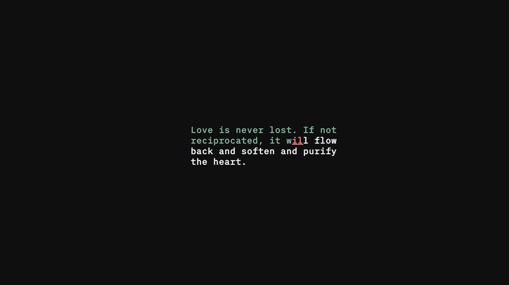

### Just Type ⌨️

## Es un acercamiento diferente a los conocidos typeRacer, pero en este caso no es para estresarte porque tus WPM tienden a 0, sino que todo lo contrario. Clonate este repo, abri el index.hml, ponete musica que te cope y disrfuta 🎧

- Presiona F11 para mas placer 1️⃣1️⃣

---
### PREVIEW 🔍

---
- Descrubrí que me relaja un monton escribir escuchando musica 🗿
- Aprendí más sobre JavaScript y sobre manejo del DOM 💻
- Utilize la Api [quotable](https://docs.quotable.io/docs/api/ZG9jOjQ2NDA2-introduction), es open source y nos permite el acceso a una collección enorme de quotes famosas 📖
- Realmente me gusto hacer este proyecto 😁
- Cuando lo termine me quede facíl, 2 horas seguidas escribiendo 🕙
---
